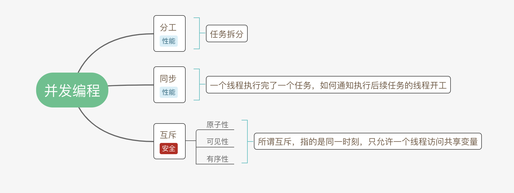
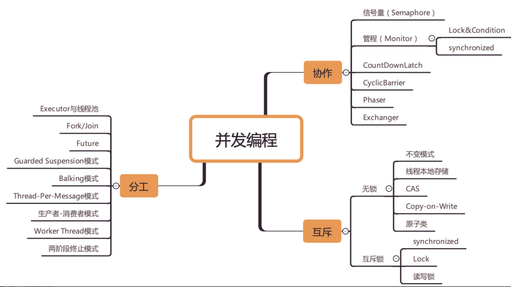

# 为什么要学习并发编程

其实并发编程可以总结为三个核心问题：__分工__、__同步__、__互斥__。

* 所谓分工指的是如何高效地拆解任务并分配给线程
* 而同步指的是线程之间如何协作
* 互斥则是保证同一时刻只允许一个线程访问共享资源。

Java SDK 并发包很大部分内容都是按照这三个维度组织的，

!!! example "例如" 

    * Fork/Join 框架就是一种分工模式
    * CountDownLatch 就是一种典型的同步方式
    * 而可重入锁则是一种互斥手段。

当把并发编程核心的问题搞清楚，再回过头来看 Java SDK 并发包，你会感觉豁然开朗，它不过是针对并发问题开发出来的工具而已，此时的 SDK 并发包可以任你“盘”了。

而且，这三个核心问题是跨语言的，你如果要学习其他语言的并发编程类库，完全可以顺着这三个问题按图索骥。Java SDK 并发包其余的一部分则是并发容器和原子类，这些比较容易理解，属于辅助工具，其他语言里基本都能找到对应的。

## 1. 分工

Java SDK 并发包里的 Executor、Fork/Join、Future 本质上都是一种分工方法。除此之外，并发编程领域还总结了一些设计模式，基本上都是和分工方法相关的，例如生产者 - 消费者、Thread-Per-Message、Worker Thread 模式等都是用来指导你如何分工的。

## 2. 同步

分好工之后，就是具体执行了。在项目执行过程中，任务之间是有依赖的，一个任务结束后，依赖它的后续任务就可以开工了，后续工作怎么知道可以开工了呢？这个就是靠沟通协作了，这是一项很重要的工作。

在并发编程领域里的同步，主要指的就是线程间的协作，本质上和现实生活中的协作没区别，不过是一个线程执行完了一个任务，如何通知执行后续任务的线程开工而已。

## 3. 互斥

分工、同步主要强调的是性能，但并发程序里还有一部分是关于正确性的，用专业术语叫“线程安全”。并发程序里，当多个线程同时访问同一个共享变量的时候，结果是不确定的。不确定，则意味着可能正确，也可能错误，事先是不知道的。而导致不确定的主要源头是可见性问题、有序性问题和原子性问题，为了解决这三个问题，Java 语言引入了内存模型，内存模型提供了一系列的规则，利用这些规则，我们可以避免可见性问题、有序性问题，但是还不足以完全解决线程安全问题。解决线程安全问题的核心方案还是互斥。

{== 所谓互斥，指的是同一时刻，只允许一个线程访问共享变量。==}

