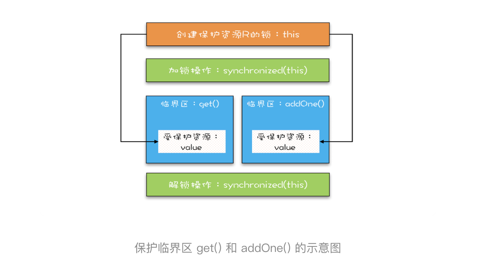

Java 语言提供的锁技术：synchronized
锁是一种通用的技术方案，Java 语言提供的 synchronized 关键字，就是锁的一种实现。synchronized 关键字可以用来修饰方法，也可以用来修饰代码块，它的使用示例基本上都是下面这个样子：


```java

class X {
  // 修饰非静态方法
  synchronized void foo() {
    // 临界区
  }
  // 修饰静态方法
  synchronized static void bar() {
    // 临界区
  }
  // 修饰代码块
  Object obj = new Object()；
  void baz() {
    synchronized(obj) {
      // 临界区
    }
  }
}  


```
看完之后你可能会觉得有点奇怪，这个和我们上面提到的模型有点对不上号啊，加锁 lock() 和解锁 unlock() 在哪里呢？其实这两个操作都是有的，只是这两个操作是被 Java 默默加上的，Java 编译器会在 synchronized 修饰的方法或代码块前后自动加上加锁 lock() 和解锁 unlock()，这样做的好处就是加锁 lock() 和解锁 unlock() 一定是成对出现的，毕竟忘记解锁 unlock() 可是个致命的 Bug（意味着其他线程只能死等下去了）。


那 synchronized 里的加锁 lock() 和解锁 unlock() 锁定的对象在哪里呢？上面的代码我们看到只有修饰代码块的时候，锁定了一个 obj 对象，那修饰方法的时候锁定的是什么呢？这个也是 Java 的一条隐式规则：

1. 当修饰静态方法的时候，锁定的是当前类的 Class 对象，在上面的例子中就是 Class X；
2. 当修饰非静态方法的时候，锁定的是当前实例对象 this。

对于上面的例子，synchronized 修饰静态方法相当于:

```java


class X {
  // 修饰静态方法
  synchronized(X.class) static void bar() {
    // 临界区
  }
}

```
修饰非静态方法，相当于：

```java


class X {
  // 修饰非静态方法
  synchronized(this) void foo() {
    // 临界区
  }
}
```

-----

```java

class SafeCalc {
  long value = 0L;
  synchronized long get() {
    return value;
  }
  synchronized void addOne() {
    value += 1;
  }
}

```


上面的代码转换为我们提到的锁模型，就是下面图示这个样子。get() 方法和 addOne() 方法都需要访问 value 这个受保护的资源，这个资源用 this 这把锁来保护。线程要进入临界区 get() 和 addOne()，必须先获得 this 这把锁，这样 get() 和 addOne() 也是互斥的。





