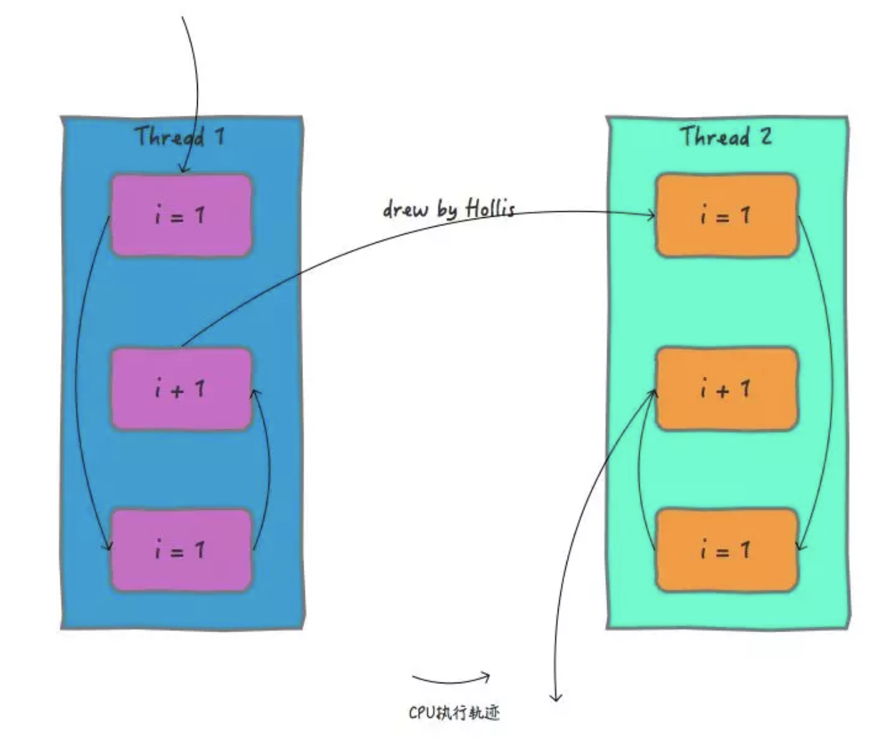
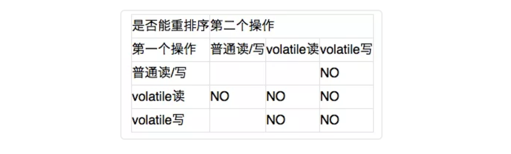
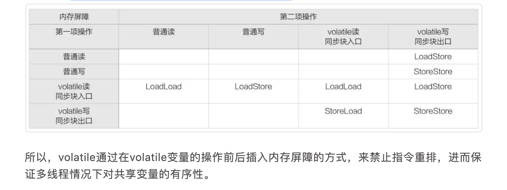

# 再有人问你volatile是什么，把这篇文章也发给他

在再有人问你Java内存模型是什么，就把这篇文章发给他中我们曾经介绍过，Java语言为了解决并发编程中存在的原子性、可见性和有序性问题，提供了一系列和并发处理相关的关键字，比如`synchronized`、`volatile`、`final`、	`concurren`		包等。在前一篇文章中，我们也介绍了`synchronized`的用法及原理。本文，来分析一下另外一个关键字——`volatile`。

本文就围绕`volatile`展开，主要介绍`volatile`的用法、`volatile`的原理，以及volatile是如何提供可见性和有序性保障的等。

`volatile`这个关键字，不仅仅在Java语言中有，在很多语言中都有的，而且其用法和语义也都是不尽相同的。尤其在C语言、C++以及Java中，都有`volatile`关键字。都可以用来声明变量或者对象。下面简单来介绍一下Java语言中的`volatile`关键字。


## volatile的用法

{++


1. volatile通常被比喻成"轻量级的synchronized"，也是Java并发编程中比较重要的一个关键字。

2. 和synchronized不同,volatile是一个变量修饰符，只能用来修饰变量。无法修饰方法及代码块等。

3. volatile的用法比较简单，只需要在声明一个可能被多线程同时访问的变量时，使用volatile修饰就可以了

++}


```java

public class Singleton {  
    private volatile static Singleton singleton;  
    private Singleton (){}  
    public static Singleton getSingleton() {  
    if (singleton == null) {  
        synchronized (Singleton.class) {  
        if (singleton == null) {  
            singleton = new Singleton();  
        }  
        }  
    }  
    return singleton;  
    }  
}  


```

如以上代码，是一个比较典型的使用双重锁校验的形式实现单例的，其中使用volatile关键字修饰可能被多个线程同时访问到的singleton。


## volatile的原理

在再有人问你Java内存模型是什么，就把这篇文章发给他中我们曾经介绍过，为了提高处理器的执行速度，在处理器和内存之间增加了多级缓存来提升。但是由于引入了多级缓存，就存在缓存数据不一致问题。

但是，对于volatile变量，当对volatile变量进行写操作的时候，JVM会向处理器发送一条lock前缀的指令，将这个缓存中的变量回写到系统主存中。

但是就算写回到内存，如果其他处理器缓存的值还是旧的，再执行计算操作就会有问题，所以在多处理器下，为了保证各个处理器的缓存是一致的，就会实现缓存一致性协议

缓存一致性协议：每个处理器通过嗅探在总线上传播的数据来检查自己缓存的值是不是过期了，当处理器发现自己缓存行对应的内存地址被修改，就会将当前处理器的缓存行设置成无效状态，当处理器要对这个数据进行修改操作的时候，会强制重新从系统内存里把数据读到处理器缓存里。

所以，如果一个变量被volatile所修饰的话，在每次数据变化之后，其值都会被强制刷入主存。而其他处理器的缓存由于遵守了缓存一致性协议，也会把这个变量的值从主存加载到自己的缓存中。这就保证了一个volatile在并发编程中，其值在多个缓存中是可见的。


## volatile与可见性

可见性是指当多个线程访问同一个变量时，一个线程修改了这个变量的值，其他线程能够立即看得到修改的值。

我们在再有人问你Java内存模型是什么，就把这篇文章发给他中分析过：Java内存模型规定了所有的变量都存储在主内存中，每条线程还有自己的工作内存，线程的工作内存中保存了该线程中是用到的变量的主内存副本拷贝，线程对变量的所有操作都必须在工作内存中进行，而不能直接读写主内存。不同的线程之间也无法直接访问对方工作内存中的变量，线程间变量的传递均需要自己的工作内存和主存之间进行数据同步进行。所以，就可能出现线程1改了某个变量的值，但是线程2不可见的情况。

前面的关于volatile的原理中介绍过了，Java中的volatile关键字提供了一个功能，那就是被其修饰的变量在被修改后可以立即同步到主内存，被其修饰的变量在每次是用之前都从主内存刷新。因此，可以使用volatile来保证多线程操作时变量的可见性。


## volatile与有序性

有序性即程序执行的顺序按照代码的先后顺序执行。

我们在再有人问你Java内存模型是什么，就把这篇文章发给他中分析过：除了引入了时间片以外，由于处理器优化和指令重排等，CPU还可能对输入代码进行乱序执行，比如load->add->save 有可能被优化成load->save->add 。这就是可能存在有序性问题。

而volatile除了可以保证数据的可见性之外，还有一个强大的功能，那就是他可以禁止指令重排优化等。

普通的变量仅仅会保证在该方法的执行过程中所依赖的赋值结果的地方都能获得正确的结果，而不能保证变量的赋值操作的顺序与程序代码中的执行顺序一致。

volatile可以禁止指令重排，这就保证了代码的程序会严格按照代码的先后顺序执行。这就保证了有序性。被volatile修饰的变量的操作，会严格按照代码顺序执行，load->add->save 的执行顺序就是：load、add、save。


## volatile与原子性


原子性是指一个操作是不可中断的，要全部执行完成，要不就都不执行。

我们在Java的并发编程中的多线程问题到底是怎么回事儿中分析过：线程是CPU调度的基本单位。CPU有时间片的概念，会根据不同的调度算法进行线程调度。当一个线程获得时间片之后开始执行，在时间片耗尽之后，就会失去CPU使用权。所以在多线程场景下，由于时间片在线程间轮换，就会发生原子性问题。

在上一篇文章中，我们介绍synchronized的时候，提到过，为了保证原子性，需要通过字节码指令monitorenter和monitorexit，但是volatile和这两个指令之间是没有任何关系的。

所以，volatile是不能保证原子性的。

在以下两个场景中可以使用volatile来代替synchronized：


!!! info

    1. 运算结果并不依赖变量的当前值，或者能够确保只有单一的线程会修改变量的值。
    2. 变量不需要与其他状态变量共同参与不变约束。


除以上场景外，都需要使用其他方式来保证原子性，如synchronized或者concurrent包。

我们来看一下volatile和原子性的例子：


```java
public class Test {
    public volatile int i = 0;

    public void increase() {
        i++;
    }

    public static void main(String[] args) {
        final Test test = new Test();
        for(int i=0;i<10;i++){
            new Thread(){
                public void run() {
                    for(int j=0;j<1000;j++)
                        test.increase();
                };
            }.start();
        }

        while(Thread.activeCount()>1)  //保证前面的线程都执行完
            Thread.yield();
        System.out.println(test.i);
    }
}

```

以上代码比较简单，就是创建10个线程，然后分别执行1000次i++操作。正常情况下，程序的输出结果应该是10000，但是，多次执行的结果都小于10000。这其实就是volatile无法满足原子性的原因。

为什么会出现这种情况呢，那就是因为虽然volatile可以保证i在多个线程之间的可见性。但是无法保证i++的原子性。

i++操作，一共有三个步骤：load i ，add i ,save i。在多线程场景中，如果这三个步骤无法按照顺序执行的话，那么就会出现问题。





如上图，两个线程同时执行i++操作，如果允许指令重排，我们期望的结果是3，但是实际执行结果可能是2，甚至可能是1。


## 总结与思考

我们介绍过了volatile关键字和synchronized关键字。现在我们知道，{== synchronized可以保证原子性、有序性和可见性。而volatile却只能保证有序性和可见性。==}

那么，我们再来看一下双重校验锁实现的单例，已经使用了synchronized，为什么还需要volatile？

```java

public class Singleton {  
    private volatile static Singleton singleton;  
    private Singleton (){}  
    public static Singleton getSingleton() {  
    if (singleton == null) {  
        synchronized (Singleton.class) {  
        if (singleton == null) {  
            singleton = new Singleton();  
        }  
        }  
    }  
    return singleton;  
    }  
}  
```
答案，我们在下一篇文章：既生synchronized，何生volatile中介绍，敬请期待。

欢迎你给出你的思考。

我们围绕volatile关键字做了很多阐述，主要介绍了volatile的用法、原理以及特性。在上一篇文章中，我提到过：volatile只能保证可见性和有序性，无法保证原子性。关于这部分内容，有读者阅读之后表示还是不是很理解，所以我再单独写一篇文章深入分析一下。

## volatile与有序性

在上一篇文章中我们提到过：volatile一个强大的功能，那就是他可以禁止指令重排优化。通过禁止指令重排优化，就可以保证代码程序会严格按照代码的先后顺序执行。那么volatile又是如何禁止指令重排的呢？

先给出结论：volatile是通过内存屏障来来禁止指令重排的。

内存屏障（Memory Barrier）是一类同步屏障指令，是CPU或编译器在对内存随机访问的操作中的一个同步点，使得此点之前的所有读写操作都执行后才可以开始执行此点之后的操作。下表描述了和volatile有关的指令重排禁止行为




!!! info "从上表我们可以看出"

    1. 当第二个操作是volatile写时，不管第一个操作是什么，都不能重排序。这个规则确保volatile写之前的操作不会被编译器重排序到volatile写之后。
    2. 当第一个操作是volatile读时，不管第二个操作是什么，都不能重排序。这个规则确保volatile读之后的操作不会被编译器重排序到volatile读之前。
    3. 当第一个操作是volatile写，第二个操作是volatile读时，不能重排序。


具体实现方式是在编译期生成字节码时，会在指令序列中增加内存屏障来保证，下面是基于保守策略的JMM内存屏障插入策略：

* 在每个volatile写操作的前面插入一个StoreStore屏障。

    * 对于这样的语句Store1; StoreLoad; Store2，在Store2及后续写入操作执行前，保证Store1的写入操作对其它处理器可见。

* 在每个volatile写操作的后面插入一个StoreLoad屏障。

    * 对于这样的语句Store1; StoreLoad; Load2，在Load2及后续所有读取操作执行前，保证Store1的写入对所有处理器可见。

* 在每个volatile读操作的后面插入一个LoadLoad屏障。

    * 对于这样的语句Load1;LoadLoad; Load2，在Load2及后续读取操作要读取的数据被访问前，保证Load1要读取的数据被读取完毕。

* 在每个volatile读操作的后面插入一个LoadStore屏障。

    * 对于这样的语句Load1; LoadStore; Store2，在Store2及后续写入操作被刷出前，保证Load1要读取的数据被读取完毕。



## volatile与可见性

在上一篇文章中我们提到过：Java中的volatile关键字提供了一个功能，{== 那就是被其修饰的变量在被修改后可以立即同步到主内存，被其修饰的变量在每次是用之前都从主内存刷新。==}

其实，volatile对于可见性的实现，内存屏障也起着至关重要的作用。因为内存屏障相当于一个数据同步点，他要保证在这个同步点之后的读写操作必须在这个点之前的读写操作都执行完之后才可以执行。并且在遇到内存屏障的时候，缓存数据会和主存进行同步，或者把缓存数据写入主存、或者从主存把数据读取到缓存。

这里稍微拓展一下，我们在内存模型是怎么解决缓存一致性问题的一文中介绍过缓存一致性协议，同时也提到过内存一致性模型的实现可以通过缓存一致性协议来实现。同时，留了一个问题：已经有了缓存一致性协议，为什么还需要volatile？

这个问题的答案可以从多个方面来回答：

!!! abstract 

    1. 并不是所有的硬件架构都提供了相同的一致性保证，Java作为一门跨平台语言，JVM需要提供一个统一的语义。
    2. 操作系统中的缓存和JVM中线程的本地内存并不是一回事，通常我们可以认为：MESI可以解决缓存层面的可见性问题。使用volatile关键字，可以解决JVM层面的可见性问题。
    3. 缓存可见性问题的延伸：由于传统的MESI协议的执行成本比较大。所以CPU通过Store Buffer和Invalidate Queue组件来解决，但是由于这两个组件的引入，也导致缓存和主存之间的通信并不是实时的。也就是说，缓存一致性模型只能保证缓存变更可以保证其他缓存也跟着改变，但是不能保证立刻、马上执行。


其实，在计算机内存模型中，也是使用内存屏障来解决缓存的可见性问题的（再次强调：缓存可见性和并发编程中的可见性可以互相类比，但是他们并不是一回事儿）。


写内存屏障（Store Memory Barrier）可以促使处理器将当前store buffer（存储缓存）的值写回主存。读内存屏障（Load Memory Barrier）可以促使处理器处理invalidate queue（失效队列）。进而避免由于Store Buffer和Invalidate Queue的非实时性带来的问题。


所以，内存屏障也是保证可见性的重要手段，操作系统通过内存屏障保证缓存间的可见性，JVM通过给volatile变量加入内存屏障保证线程之间的可见性。


!!! warning "内存屏障"

    再来总结一下Java中的内存屏障：用于控制特定条件下的重排序和内存可见性问题。Java编译器也会根据内存屏障的规则禁止重排序。


## volatile与原子性

在以前的文章中，我们介绍synchronized的时候，提到过，为了保证原子性，需要通过字节码指令monitorenter和monitorexit，但是volatile和这两个指令之间是没有任何关系的。volatile是不能保证原子性的。

网上有很多文章，拿i++的例子说明volatile不能保证原子性，然后进行各种分析，有的说由于引入内存屏障导致无法保证原子性，有的说一段i++代码，在编译后字节码为：


```java
10: getfield      #2                  // Field i:I
14: iconst_1
15: iadd
16: putfield      #2                  // Field i:I
```


在不考虑内存屏障的情况下，一个i++指令也包含了四个步骤。

这些分析，只是说明了i++本身并不是一个原子操作，即使使用`volatile`修饰i，也无法保证他是一个原子操作。并不能解释为什么`volatile`为啥不能保证原子性。

要我说，由于CPU按照时间片来进行线程调度的，只要是包含多个步骤的操作的执行，天然就是无法保证原子性的。因为这种线程执行，又不像数据库一样可以回滚。如果一个线程要执行的步骤有5步，执行完3步就失去了CPU了，失去后就可能再也不会被调度，这怎么可能保证原子性呢。

为什么`synchronized`可以保证原子性 ，因为被`synchronized`修饰的代码片段，在进入之前加了锁，只要他没执行完，其他线程是无法获得锁执行这段代码片段的，就可以保证他内部的代码可以全部被执行。进而保证原子性。

但是`synchronized`对原子性保证也不绝对，如果真要较真的话，一旦代码运行异常，也没办法回滚。所以呢，在并发编程中，原子性的定义不应该和事务中的原子性一样。他应该定义为：一段代码，或者一个变量的操作，在没有执行完之前，不能被其他线程执行。

那么，为什么volatile不能保证原子性呢？因为他不是锁，他没做任何可以保证原子性的处理。当然就不能保证原子性了。

## 总结

__文在上一篇文章的基础上，再次介绍了volatile和原子性、有序性以及可见性之间的关系。有序性和可见性是通过内存屏障实现的。而volatile是无法保证原子性的__


至此，并发编程系列文章已经出了很多篇了，不知道读者对于这部分内容还有没有什么疑问和更多学习建议。欢迎留言。点击阅读原文，查看该系列所有文章


