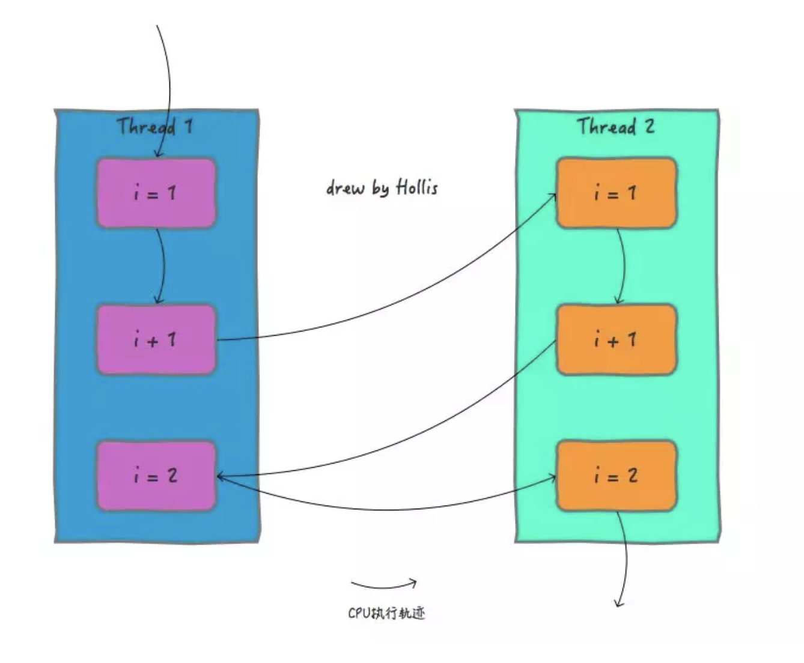
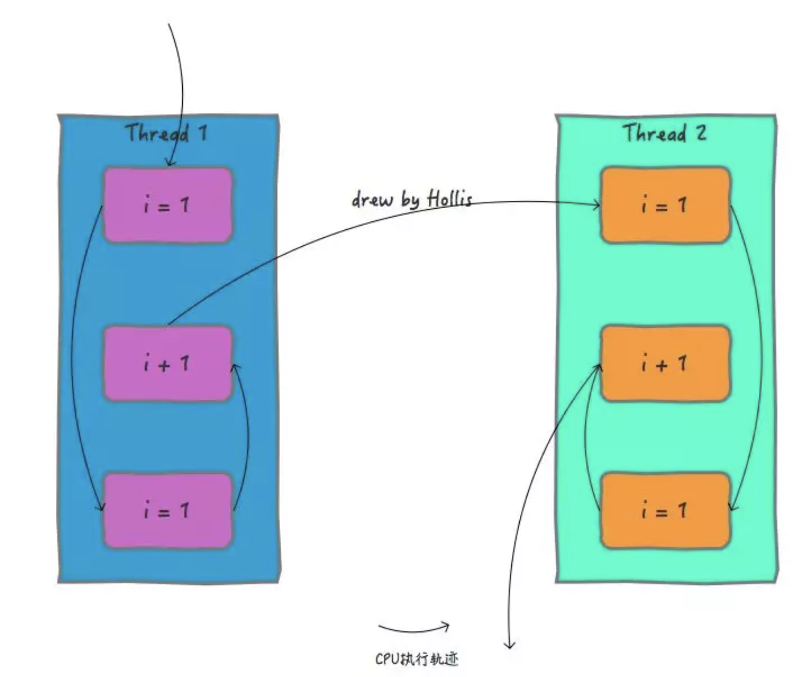

# Java的并发编程中的多线程问题到底是怎么回事儿？

在我之前的一篇《再有人问你Java内存模型是什么，就把这篇文章发给他。》文章中，介绍了Java内存模型，通过这篇文章，大家应该都知道了Java内存模型的概念以及作用，这篇文章中谈到，在Java并发编程中，通常会遇到三个问题，即__原子性__问题、__一致性__问题和__有序性__问题。

上面一篇文章简单介绍了一下，由于各种原因会导致多线程场景下可能存在原子性、一致性和有序性问题。但是并没有深入，这篇文章就来在之前的基础上，再来看一下，并发编程中，这些问题都是哪来的？

首先，我们还是从操作系统开始，先来了解一些基础知识。

## CPU时间片

很多人都知道，现在我们用到操作系统，无论是Windows、Linux还是MacOS等其实都是多用户多任务分时操作系统。使用这些操作系统的“用户”是可以“同时”干多件事的，这已经是日常习惯了，并没觉得有什么特别。

但是实际上，对于单CPU的计算机来说，在CPU中，同一时间是只能干一件事儿的。

为了看起来像是“同时干多件事”，分时操作系统是把CPU的时间划分成长短基本相同的时间区间,即”时间片”，通过操作系统的管理，把这些时间片依次轮流地分配给各个“用户”使用。

如果某个“用户”在时间片结束之前，整个任务还没有完成，“用户”就必须进入到就绪状态，放弃CPU，等待下一轮循环。此时CPU又分配给另一个“用户”去使用。

!!! example

    CPU 就好像是一个电话亭，他可以开放给所有用户使用，但是他有规定，每个用户进入电话亭之后只能使用规定时长的时间。如果时间到了，用户还没打完电话，那就会被要求去重新排队。

    
不同的操作系统，在选择“用户”分配时间片的调度算法是不一样的，常用的有FCFS、轮转、SPN、SRT、HRRN、反馈等，由于不是本文重点，就不展开了。

!!! example "说明"

    这个电话亭可以允许哪个用户进入打电话是有不同的策略的，不同的电话亭规定不同，有的电话亭采用排队机制（FCFS）、有的优先分配给打电话时间最短的人（SPN）等

## 进程与线程

前面介绍CPU时间片的时候提到了CPU会根据不同的调度算法把时间片分配给“用户”，这里的“用户”在以前指的是进程，随着操作系统的不断发展，现在一般指线程。

在过去没有线程的操作系统中，资源的分配和执行都是由进程完成的。随着技术的发展，为了减少由于进程切换带来的开销，提升并发能力，操作系统中引入线程。把原本属于进程的工作一分为二，进程还是负责资源的分配，而线程负责执行。

__也就是说，进程是资源分配的基本单位，而线程是调度的基本单位__

## 多线程中的并发问题

了解了以上的和硬件及操作系统有关的基础知识以后，我们再来看下，在多线程场景中有哪些并发问题。

关于并发编程中的原子性、可见性和有序性问题我在《内存模型》一文介绍过。

{== 文中提到：缓存一致性问题其实就是可见性问题。而处理器优化是可以导致原子性问题的。指令重排即会导致有序性问题。有部分读者对这部分不是很理解。由于上一篇文章主要介绍内存模型，并没有展开分析，只是给了个结论，这里再针对这部分深入分析一下。
==}

由于缓存一致性问题导致可见性问题，在《内存模型》中介绍的很清晰了，这里就不赘述了，主要结合本文来分析下原子性问题和有序性问题。

## 原子性问题

我们说原子性问题，其实指的是多线程场景中操作如果不能保证原子性，会导致处理结果和预期不一致。

前面我们提到过，线程是CPU调度的基本单位。CPU有时间片的概念，会根据不同的调度算法进行线程调度。所以在多线程场景下，就会发生原子性问题。因为线程在执行一个读改写操作时，在执行完读改之后，时间片耗完，就会被要求放弃CPU，并等待重新调度。这种情况下，读改写就不是一个原子操作。

!!! info 

    就好像我们去电话亭打电话，一共有三个步骤，查找电话，拨号，交流。由于我们在电话亭中可以停留的时间有限，有可能刚刚找到电话号码，时间到了，就被赶出来了。

在单线程中，一个读改写就算不是原子操作也没关系，因为只要这个线程再次被调度，这个操作总是可以执行完的。但是在多线程场景中可能就有问题了。因为多个线程可能会对同一个共享资源进行操作。

比如经典的 `i++` 操作，对于一个简单的 `i++` 操作，一共有三个步骤：load , add ,save 。共享变量就会被多个线程同时进行操作，这样读改写操作就不是原子的，操作完之后共享变量的值会和期望的不一致，举个例子：如果i=1,我们进行两次i++操作，我们期望的结果是3，但是有可能结果是2。

### 有序性问题

而且，我们知道，除了引入了时间片以外，由于处理器优化和指令重排等，CPU还可能对输入代码进行乱序执行，比如load->add->save 有可能被优化成load->save->add 。这就是有序性问题。

!!! snippet

    我们打电话的时候，除了可能被中途赶出来以外，本来正常步骤是要查找电话、拨号、交流的。但是电话亭非要给我们优化成查找电话、交流、拨号。这肯定不是我们想要的啊。

还是刚刚的i++操作，在满足了原子性的情况下，如果没有满足有序性，那么得到的结果可能也不是我们想要的。

## 总结

本文主要介绍了并发编程中会导致原子性和有序性问题的原因，关于可见性请参考《内存模型》。关于这三种问题的解决方案在《内存模型》也有介绍，更多的可以参考多线程相关书籍。Hollis后续也会出更多文章再深入分析，敬请期待。

